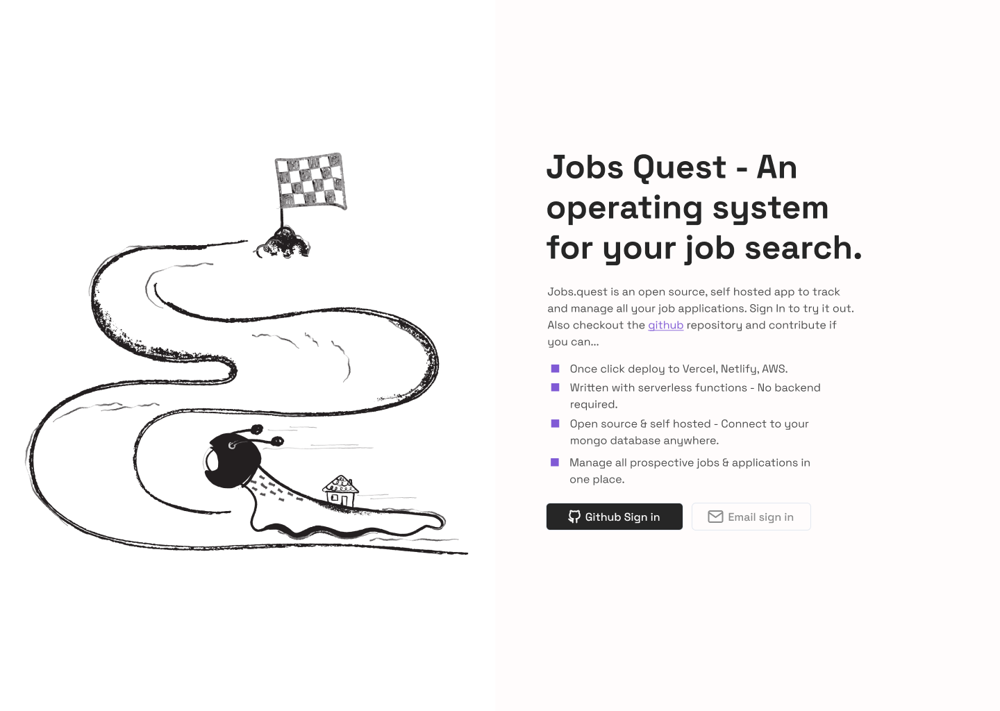

# Job Quest

Jobs.quest is an open source, self hosted app to track and manage all your job applications. Clone the repo to try it out...

Here's a few exciting features

- 😅 Switch to an easier way to manage your job applications
- 👌🏼 It's open source and you can host it yourself, anywhere (https://github.com/vickOnRails/job.quest)
- 🚀 One click deploy to (Vercel, Netlify, AWS)
- 🎨Customize your version as you desire
- 🙋🏼‍♂️ Built in public. Suggest features and they'll be added

## Deploy on Vercel

The easiest way to deploy your Next.js app is to use the [Vercel Platform](https://vercel.com/new?utm_medium=default-template&filter=next.js&utm_source=create-next-app&utm_campaign=create-next-app-readme) from the creators of Next.js.

Check out our [Next.js deployment documentation](https://nextjs.org/docs/deployment) for more details.
